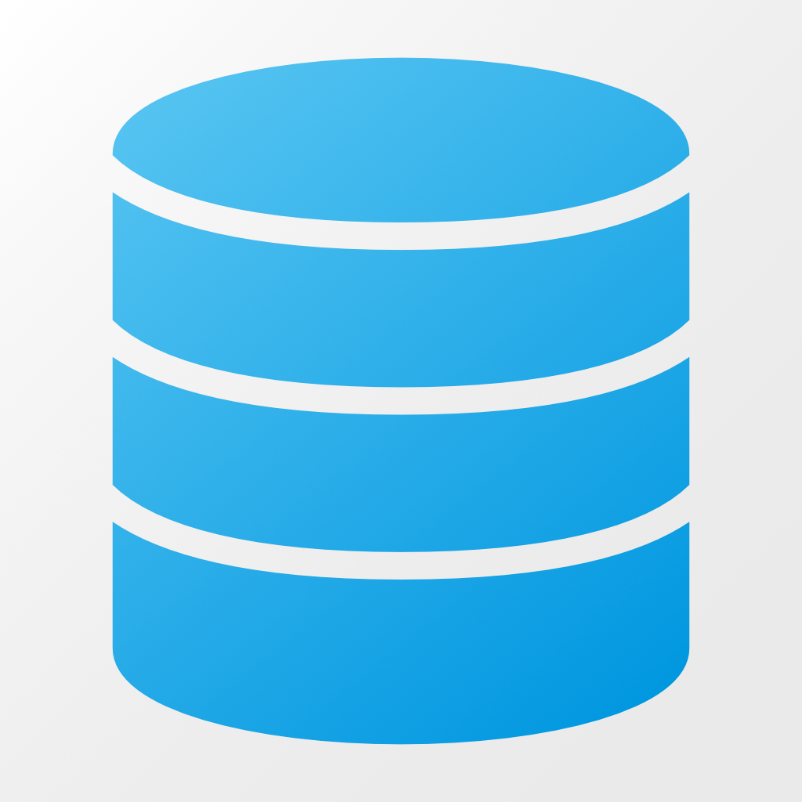
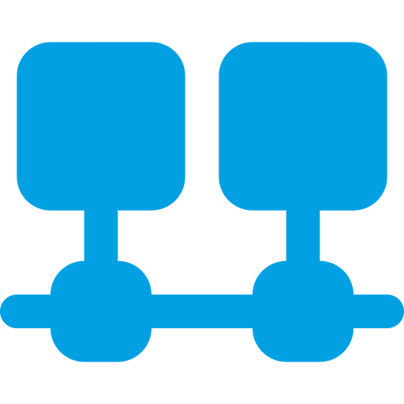
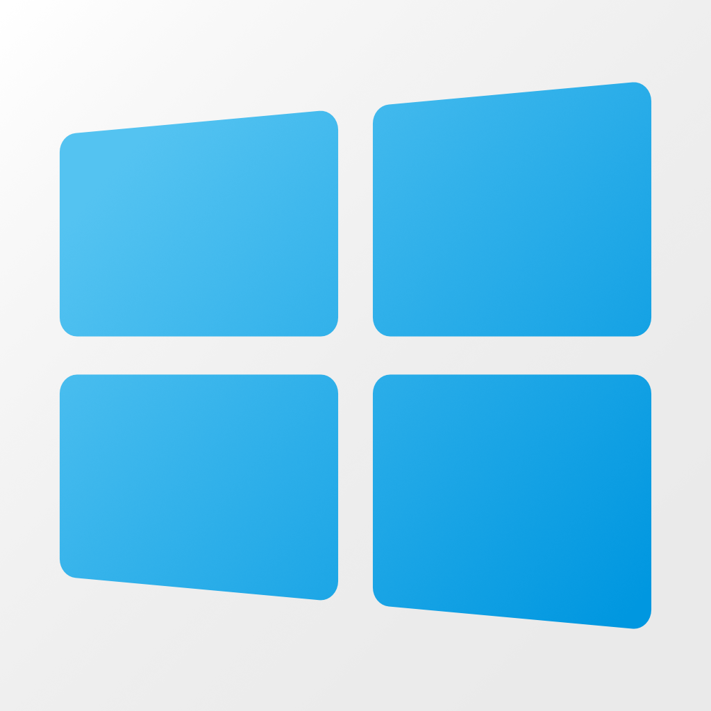
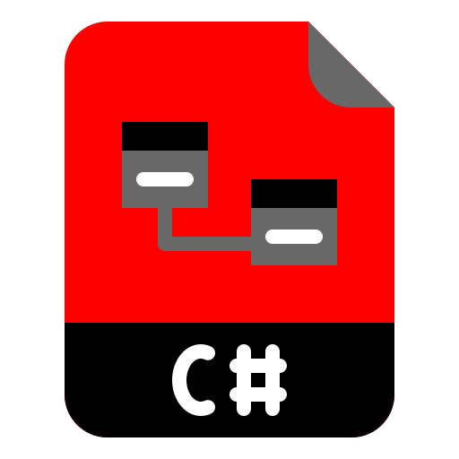

# DotNetLib Projects
The following specific projects are available, used to create corresponding NuGet packages for NuGet.org.  Read their associated readme file for specific details.

| Library                                                                    | Framework            | NuGet Package and Specific Readme Information                                                                                                                                                                                                                                                                           |
|----------------------------------------------------------------------------|----------------------|-------------------------------------------------------------------------------------------------------------------------------------------------------------------------------------------------------------------------------------------------------------------------------------------------------------------------|
| | .NET Standard 2.0    |  [Daikin.DotNetLib.Application](Daikin.DotNetLib.Application/README.md) has basic functions to generically assist with applications                                             |
|               | .NET Standard 2.0    |  [Daikin.DotNetLib.Data](Daikin.DotNetLib.Data/README.md) contains basic classes to assist with specific data types                                                                           |
|   | .NET Framework 4.7.2 |  [Daikin.DotNetLib.DotNetNuke](Daikin.DotNetLib.DotNetNuke/README.md) supports Module Development on DNN (formerly DotNetNuke), the C# open source Content Management System (CMS)|
|       | .NET Standard 2.0    |  [Daikin.DotNetLib.Facebook](Daikin.DotNetLib.Facebook/README.md) supports Facebook API calls to pull content for a single source of information                                      |
|           | .NET Standard 2.0    |  [Daikin.DotNetLib.MsTeams](Daikin.DotNetLib.MsTeams/README.md) are helpers for Microsoft Teams integration                                                                               |
|         | .NET Standard 2.0    |  [Daikin.DotNetLib.Network](Daikin.DotNetLib.Network/README.md) are helpers for making Web Api calls (typically JSON-based), SMTP, Networking, etc. calls                               |
|       | .NET Standard 2.0    |  [Daikin.DotNetLib.Security](Daikin.DotNetLib.Security/README.md) provides security helper to make it easier to encrypt and decrypt data                                              |
|           | .NET Framework 4.7.2 |  [Daikin.DotNetLib.Serial](Daikin.DotNetLib.Serial/README.md) are Windows-based USB and Serial port helpers for Windows-based applications                                                |
|         | .NET Standard 2.0    |  [Daikin.DotNetLib.Serilog](Daikin.DotNetLib.Serilog/README.md) are contains helper functions to assist with Serilog logging usage, especially with Microsoft and Azure SQL Server      |
|         | .NET Framework 4.7.2 |  [Daikin.DotNetLib.Windows](Daikin.DotNetLib.Windows/README.md) are helpers for Windows-based applications                                                                              |
|    | .NET 6               | [Daikin.DotNetLib.Core.Tests](Daikin.DotNetLib.Core.Tests/README.md) are .NET Core xUnit Tests, serves as coding samples                                                                                                                                                                                                |

# Introduction

These .NET Standard, Core, and Framework libraries are a collection of work intended to share (give back), collaborate, and learn.

# Getting Started
This presumes a strong understanding of the following tools and technologies, and that they are installed.

- Visual Studio 2022 (Community, Professional, or Enterprise)
- C# development
- Web API (for specific projects)
- Graph API (for specific projects)
- Code Signing Certificate must be installed to digitally sign NuGet packages, PowerShell scripts, and DLLs.
- NuGet packages (nupkg) must be digitally signed before deploying to NuGet.org.  See the PowerShell script *.\PublishNuGet.ps1*.  This script can be run within the Package Manager Console in Visual Studio.
- Signtool.exe (see below)

## Digital Signing via Signtool.exe
Signtool.exe is installed as part of Visual Studio 2019 and 2017 via *C:\Program Files (x86)\Microsoft SDKs\ClickOnce\SignTool*.  This tool is available via the Windows 10 SDK.

All of the projects use the following Post Build Event (e.g., Project Properties > *Build Events* > *Post-built event command line*):

	codesign.bat "$(TargetPath)"

Create a batch file called *codesign.bat*.  

In the *codesign.bat* file, include something like:

	@ECHO OFF
	REM Change the Subject to your own Code-Signing Certificate that is installed in your Local Machine Store
	SET subject=Daikin Applied Americas Inc.
	SET filespec=%~1
	IF /I "%filespec:~-5%"=="nupkg" GOTO NuGetSign
	:SignTool
	"C:\Program Files (x86)\Microsoft SDKs\ClickOnce\SignTool\signtool.exe" sign /sm /n "%subject%" /t "http://timestamp.verisign.com/scripts/timstamp.dll" "%filespec%"
	GOTO Done
	:NuGetSign
	REM Get NuGet CommandLine from https://www.nuget.org/downloads
	nuget sign "%filespec%" -CertificateStoreLocation "LocalMachine" -CertificateSubjectName "%subject" -TimeStamper "http://timestamp.comodoca.com?td=sha256"
	GOTO Done
	:Done
	ECHO.

This solution handles executables (exe files), dynamic link libraries (dll files), PowerShell (ps1 files), and NuGet Packages (nupkg files), making it very versitile by calling *codesign &lt;yourfile&gt;*.  As long as every developer has *codesign.bat* setup, they can all compile this project using a desired code signing certificate.

Add *codesign.bat* to your Windows System PATH:
1. Open Control Panel (Start > type *control panel*)
2. Open the *System* control panel item
3. Select *Advanced system settings* on the left pane
4. Click on *Environmental Variables* button in the *Advanced* tab (open by default)
5. In the System variable section, locate the PATH environment variable.  Add to the front the full path to *codesign.bat*.

After updating the PATH, it is recommended you restart your computer or restart all PowerShell, Command Prompt, and applications so they are able to access the updated path.

# Contribution
While primarily (at this point) done by the [Daikin Applied](https://www.daikinapplied.com) Web Development Team, all .NET developers are welcome to strengthen these libraries. 

Original development contribution by [Hans Dickel](https://www.recursivegeek.com) as a way to give back to the development community and share his geekiness and passion for the Microsoft development stack.

# License
This project is licensed under the [MIT License](https://opensource.org/licenses/MIT).

~ End ~
