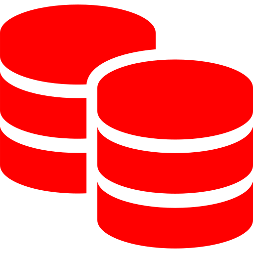
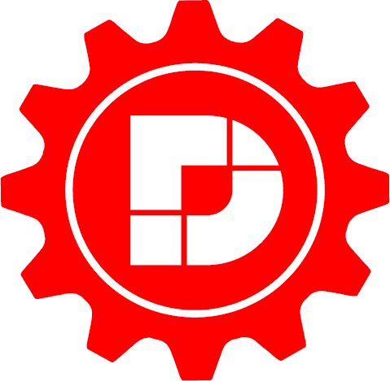
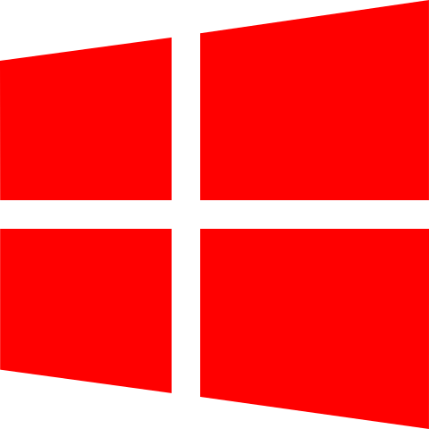

# DotNetLib Projects
This project has been moved to the DaikinApplied/DotNetLib GitHub repo, using Daikin.DotNetLib.* projects, namespaces, and NuGet package names.  Updates will no longer occur on the RecursiveGeek.DotNetLib repo.  This change allows for increased management and visibility to Daikin.  This still encourages support by all those that wish to do such, regardless of being affiliated with Daikin or Daikin Applied.  All RecursiveGeeks are acknowledged!  :-)

The following specific projects are available, used to create corresponding NuGet packages for NuGet.org.  Read their associated readme file for specific details.

| Library                                                                           | NuGet Package (and specific README)                                                                                                                                                            |
|-----------------------------------------------------------------------------------|------------------------------------------------------------------------------------------------------------------------------------------------------------------------------------------------|
| | [RecursiveGeek.DotNetLib.Application](RecursiveGeek.DotNetLib.Application/README.md) are basic functions to generically assist with applications                                               |
|               | [RecursiveGeek.DotNetLib.Data](RecursiveGeek.DotNetLib.Data/README.md) are basic classes to assist with specific data types                                                                    |
|   | [RecursiveGeek.DotNetLib.DotNetNuke](RecursiveGeek.DotNetLib.DotNetNuke/README.md) supports Module Development on DNN (formerly DotNetNuke), the C# open source Content Management System (CMS)|
|       | [RecursiveGeek.DotNetLib.Facebook](RecursiveGeek.DotNetLib.Facebook/README.md) supports Facebook API calls to pull content for a single source of information                                  |
|       | [RecursiveGeek.DotNetLib.Security](RecursiveGeek.DotNetLib.Security/README.md) provides security helper to make it easier to encrypt and decrypt data                                          |
|         | [RecursiveGeek.DotNetLib.Network](RecursiveGeek.DotNetLib.Network/README.md) are helpers for making Web Api calls (typically JSON-based), SMTP, Networking, etc. calls                         |
|         | [RecursiveGeek.DotNetLib.Windows](RecursiveGeek.DotNetLib.Windows/README.md) are helpers for Windows-based applications                                                                        |
|           | [RecursiveGeek.DotNetLib.Serial](RecursiveGeek.DotNetLib.Serial/README.md) are Windows-based USB and Serial port helpers for Windows-based applications                                        |
|    | [RecursiveGeek.DotNetLib.Core.Tests](RecursiveGeek.DotNetLib.Core.Tests/README.md) are .NET Core xUnit Unit Tests, serves as coding samples                                                    |

# Introduction

These .NET Standard, Core, and Framework libraries are a collection of work intented to share (give back), collaborate, and learn.

# Getting Started
This presumes a strong understanding of the following tools and technologies, and that they are installed.

- One of the following Visual Studio releases (Community, Professional, or Enterprise), fully patched:
	- Visual Studio 2019
	- Visual Studio 2017
- .NET Standard 2.0 libraries (used whenever possible)
- .NET Framework 4.5.2 (maximizing backward compatibility with .NET Framework projects and still supported by Microsoft)
- .NET Framework 4.7.2 (for DotNetNuke project to support DNN library requirements)
- .NET Core 2.2 SDK (for xUnit Testing)
- C# development
- Web API (for specific projects)
- Graph API (for specific projects)
- Code Signing Certificate must be installed to digitally sign NuGet packages, PowerShell scripts, and DLLs.
- NuGet packages (nupkg) must be digitally signed before deploying to NuGet.org.  See the PowerShell script *.\PublishNuGet.ps1*.  This script can be run within the Package Manager Console in Visual Studio.
- Signtool.exe (see below)

## Digital Signing via Signtool.exe
Signtool.exe is installed as part of Visual Studio 2019 and 2017 via *C:\Program Files (x86)\Microsoft SDKs\ClickOnce\SignTool*.  This tool is available via the Windows 10 SDK.

All of the projects use the following Post Build Event (e.g., Project Properties > *Build Events* > *Post-built event command line*):

	codesign.bat "$(TargetPath)"

Create a batch file called *codesign.bat*.  

In the *codesign.bat* file, include something like:

	@ECHO OFF
	REM Change the Subject to your own Code-Signing Certificate that is installed in your Local Machine Store
	SET subject=Daikin Applied Americas Inc.
	SET filespec=%~1
	IF /I "%filespec:~-5%"=="nupkg" GOTO NuGetSign
	:SignTool
	"C:\Program Files (x86)\Microsoft SDKs\ClickOnce\SignTool\signtool.exe" sign /sm /n "%subject%" /t "http://timestamp.verisign.com/scripts/timstamp.dll" "%filespec%"
	GOTO Done
	:NuGetSign
	REM Get NuGet CommandLine from https://www.nuget.org/downloads
	nuget sign "%filespec%" -CertificateStoreLocation "LocalMachine" -CertificateSubjectName "%subject" -TimeStamper "http://timestamp.comodoca.com?td=sha256"
	GOTO Done
	:Done
	ECHO.

This solution handles executables (exe files), dynamic link libraries (dll files), PowerShell (ps1 files), and NuGet Packages (nupkg files), making it very versitile by calling *codesign &lt;yourfile&gt;*.  As long as every developer has *codesign.bat* setup, they can all compile this project using a desired code signing certificate.

Add *codesign.bat* to your Windows System PATH:
1. Open Control Panel (Start > type *control panel*)
2. Open the *System* control panel item
3. Select *Advanced system settings* on the left pane
4. Click on *Environmental Variables* button in the *Advanced* tab (open by default)
5. In the System variable section, locate the PATH environment variable.  Add to the front the full path to *codesign.bat*.

After updating the PATH, it is recommended you restart your computer or restart all PowerShell, Command Prompt, and applications so they are able to access the updated path.

# Contributors
- Hans Dickel (a RecursiveGeek)
- Aeriden LLC (RecursiveGeek Consulting)
- Daikin Applied Americas Inc (full of RecursiveGeeks that use significantly and contribute feedback)

# Contribution
Developers are welcome to strength their inner recursive geekness to make this better.  

This is being managed under Aeriden LLC for the sake of organizational representation and contribution.

The Code Signing is being done under Daikin Applied Americas Inc as the initial biggest consumption benefactor of these libraries.

# License
This project is licensed under the [MIT License](https://opensource.org/licenses/MIT).

~ end ~
